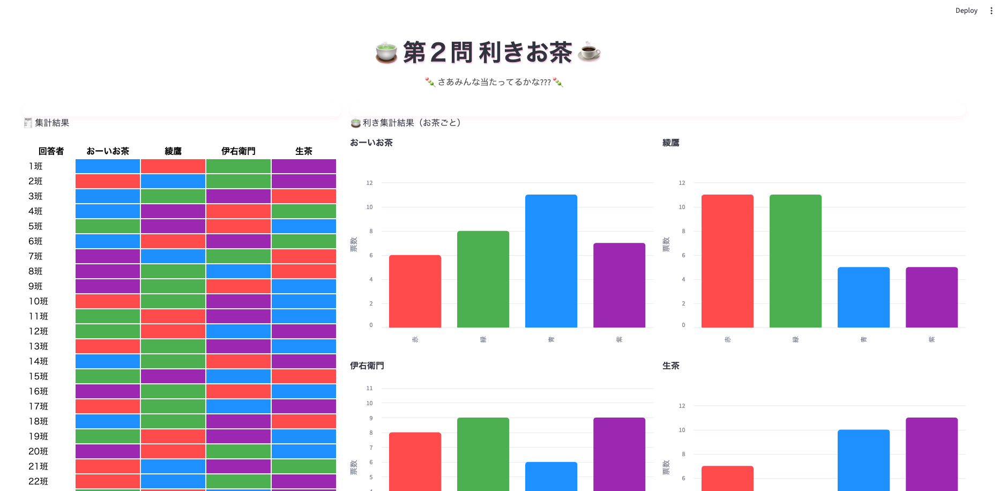

# 🥤 Bridge2025 利き〇〇可視化ダッシュボード

このアプリは **Bridge2025** イベントで使用される「利き〇〇」ゲームの集計結果を可視化する Streamlit ダッシュボードです。  
各班の回答をランダム生成し、色ごとの集計とドリンク別の人気傾向をグラフで表示します。


## 🚀 セットアップ手順

### 1️⃣ 仮想環境の作成

```bash
python -m venv .venv
```

### 2️⃣ 仮想環境の有効化

**Mac / Linux:**
```bash
source .venv/bin/activate
```

**Windows:**
```bash
.venv\Scripts\activate
```

### 3️⃣ 依存パッケージのインストール

```bash
pip install -r requirements.txt
```

> ※ `requirements.txt` がない場合は以下を直接実行してください：

```bash
pip install streamlit pandas numpy streamlit-autorefresh altair
```

---

## 🧠 実行方法

```bash
streamlit run app_tea.py
```

実行後、ターミナルに表示される URL（例：  
👉 http://localhost:8501 ）をブラウザで開くと、ダッシュボードが表示されます。

---

## 📁 ディレクトリ構成

```bash
project-root/
├── app_sport.py
├── app_tea.py          # メイン Streamlit アプリ
├── assets/
│   └── header.png      # ヘッダー画像（任意）
├── requirements.txt    # 依存関係（任意）
└── README.md           # このファイル
```

## 💡 アプリの特徴

- ページは **3秒ごとに自動リフレッシュ** され、結果が動的に更新されます。  
- 集計テーブルでは各班のドリンク選択を **色分け可視化**。  
- Altair を用いた **棒グラフ可視化** により、ドリンク別の人気傾向が一目でわかります。  
- シンプルかつモダンなデザイン（CSS カスタマイズ済み）。  

## 画面例


## 📜 使用技術

- **Python 3.10+**
- **Streamlit**
- **Pandas / Numpy**
- **Altair**
- **streamlit-autorefresh**


## 🧾 ライセンス / クレジット

© Bridge 2025 利きゲーム  
Produced by Bridge Team
